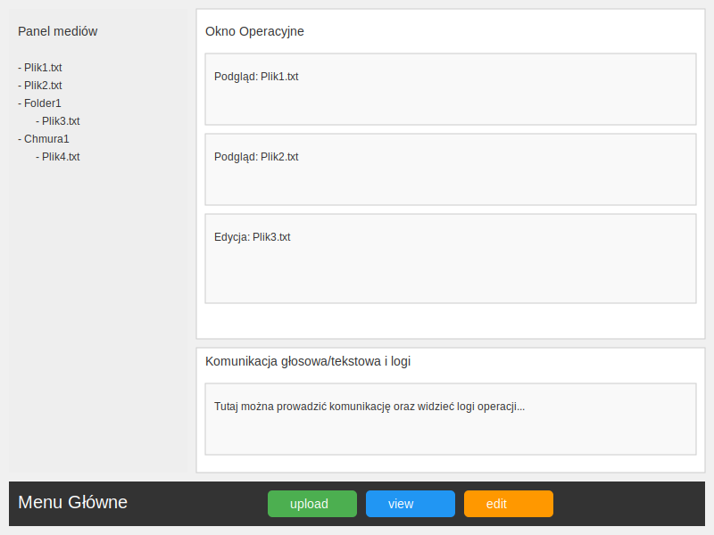
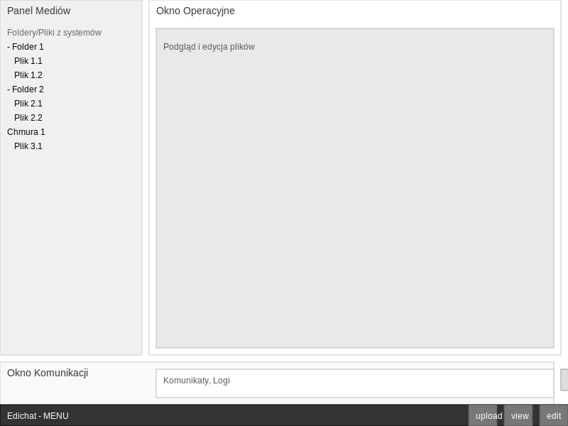

Grafika SVG przedstawiająca optymalny interfejsu użytkownika GUI, który zawiera kilka okienek do działań/operacji na wielu obiektach, plikach pobieranych z dysku/chmury oraz umożliwia komunikację głosową lub tekstową. 

1. Panel mediów po lewej stronie rozciąga się od góry do dołu. Zawiera pliki i foldery w postaci struktury z różnych źródeł, systemów, chmur, pliki dodaje się w oknie chat 
2. Okno Operacyjne w centrum oferuje podgląd i edycje tych plików z  panelu mediów
3. Okno komunikacji głosowej/tekstowej znajduje się na dole, zaczynając się od końca panelu mediów. Przeznaczone do komunikacji człowieka z programem, komunikatów o stanie mediów, logi z operacji.
4. Na samym dole, poniżej panelu mediów i okna komunikacji znajudje się odseparowany od lewej do prawej pasek aplikacji z logiem CoDialog i napisem napisem "MENU" oraz przyciskami [upload], [run], [edit]

## v1

+ [svgviewer project](https://www.svgviewer.dev/s/wcaZPWIE)
  
## v2

+ [svgviewer project](https://www.svgviewer.dev/s/t3pke0RG)

## svgviewer

