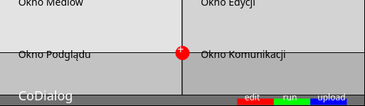

# [CoDialog - mesh collaboration](http://gui.codialog.com)

## Demo

Poniżej znajdują się kolejne implementacje interfejsu dla aplikacji #CoDialog

+ [codialog-multi-IDE.mp4](codialog-multi-IDE.mp4)
+ [codialog-multi-IDE-v2.mp4](codialog-multi-IDE-v2.mp4)

Poniżej znajduje się #demo aplikacji  #CoDialog na tablet 

+ [codialog-gui-tablet.mp4](codialog-gui-tablet.mp4)

## Filozofia

To GUI jest unikalne z kilku względów:
+ działa tak samo na każdej platformie i przeglądarce
+ intuicyjny i minimalistyczny interfejs
+ użytkownik definiuje własne zestawy okien do różnych celów w oparciu o własne usługi
+ mechanizm sesji pozwala na jednoczesną pracę na wielu urządzeniach jednocześnie
+ dopasowane do każdego typu aplikacji na poziomie protokołu i API
+ demonstracyjna wersja działa w oparciu o docker compose z konfiguracją usług
 

## Historia powstania

Gdy rozmawialiśmy z kolegą o biotechnologi, zrozumiałem jak wiele trzeba się nauczyć i jak wiele aplikacji i formatów danych używać.
Ta perspektywa zdeterminowała mnie do przemyślenia sposobu interakcji w celu przyśpieszenia prac nad różnymi projektami poprzez interfejs.
Zdefiniowałem kilka kluczowych cech jakie powinien posiadać taki interfejs:
+ lekki
+ elastyczny
+ skupiony na treści
+ ułatwiający przełączanie zestawów okien 
+ dystrybujący aplikacje bezpośrednio na poziomie definicji **URI** jak w **Apache Camel** dla API i protokołów

## Możliwości użycia

Od edytora po zarządzanie, administrację, development, monitoring, kompleksowe projekty biotechnologiczne ...
CoDialog to uniwersalne narzędzie z wykorzystaniem dostępu do data i cloud computing oraz wirtualizacją zasobów na maszynie roboczej.
Zuniifkowany interfejs niezależny od platformy i wielkości ekranu pozwoli cieszyć się zasobami i funkcjami dotychczas tam nie dostepnymi lub ograniczonymi.

to dlatego AI (chatgpt) LLMy i python są popularne bo mają niski próg wejścia od strony interfejsu ...

+ jedna z implementacji, [cameraMonit](http://app.cameramonit.com) służy do monitoringu kamer w oknach GUI codialog z chatem do pytania kamer o zdarzenia z ostatnich 24 godzin, kamery IP korzystają z protokołu RTSMP, który jest również obsługiwany przez rozszerzenia GUI CoDialog.

## Opis GUI

#GUI zawiera kilka okienek do działań/operacji na wielu obiektach, plikach pobieranych z dysku/chmury oraz umożliwia komunikację głosową lub tekstową. 

### Okna

Aplikacja składa się z 4 okien w formie kratki, kolejno:

+ 1.Okno mediów (górne lewe)

+ 2.Okno Edycji (górne prawe)

+ 3.Okno podglądu (dolne lewe) 

+ 4.Okno komunikacji  (dolne prawe)

### Przycisk **CoPoint** i menu doboru okien **CoWindow**

Na skrzyżowaniu wszystkich okien znajduje się przycisk pozwalający na zmianę wielkości wszystkich okien jednocześnie, możliwe po najechaniu i przytrzymaniu przycisku możliwe jest przesunięcie centrum zbiegania się wszystkich okien.

### Pasek główny aplikacji, menu **CoPanel**

Na samym dole, poniżej okna podglądu i okna komunikacji znajudje się odseparowany od dołu, od lewej do prawej pasek aplikacji **CoPanel** z logiem CoDialog i napisem napisem "CoDialog" oraz przyciskami [upload], [run], [edit]

---

## Wcześniejsze wersje makiety

Grafika SVG przedstawiająca optymalny interfejsu użytkownika GUI, który zawiera kilka okienek do działań/operacji na wielu obiektach, plikach pobieranych z dysku/chmury oraz umożliwia komunikację głosową lub tekstową. 
Aplikacja jest napisana za pomocą React
Aplikacji składa się z 4 okien w formie kratki, kolejno od lewej górnej 1.Okno mediów, po prawej 2.Okno Edycji, od lewego dołu 3.Okno podglądu, 4. Okno komunikacji
Na skrzyżowaniu wszystkich okien znajduje się przycisk pozwalający na resize wielkości wszystkich okien jednocześnie, mołżiwe po naciśnijęu i przytrzymaniu przycisku możliwe jest przesunięcie centrum zbiegania się wszystkich okien.

1. Okno mediów po lewej stronie rozciąga się od góry do dołu. Zawiera pliki i foldery w postaci struktury z różnych źródeł, systemów, chmur, pliki dodaje się w oknie chat 
2. Okno Edycji zaznaczonego pliku z okna mediów
3. Okno podglądu mediów zaznaczonych w oknie mediów
4. Okno komunikacji głosowej/tekstowej znajduje się na dole, zaczynając się od końca oknie mediów. Przeznaczone do komunikacji człowieka z programem, komunikatów o stanie mediów, logi z operacji.

5. Na samym dole, poniżej okna podglądu i okna komunikacji znajudje się odseparowany od dołu, od lewej do prawej pasek aplikacji z logiem CoDialog i napisem napisem "CoDialog" oraz przyciskami [upload], [run], [edit]

**CoDialog** to u niwersalna apka z wykorzystaniem dostępu do data i cloud computing oraz wirtualizacją zasobów na maszynie roboczej.
Zuniifkowany interfejs niezależny od platformy i wielkości ekranu pozwoli cieszyć się zasobami i funkcjami dotychczas tam nie dostepnymi lub ograniczonymi.

## v1

+ [svgviewer project](https://www.svgviewer.dev/s/wcaZPWIE)
  
## v2

+ [svgviewer project](https://www.svgviewer.dev/s/t3pke0RG)

## v3

+ [svgviewer](https://www.svgviewer.dev/s/s3XFnFc0)
  
## v4

+ [svgviewer](https://www.svgviewer.dev/s/inivyRMZ)

## v5

+ [svgviewer](https://www.svgviewer.dev/s/IGxU0fl7)

## v6

+ [svgviewer](https://www.svgviewer.dev/s/PflTbtQ2)

## v7

+ [svgviewer](https://www.svgviewer.dev/s/nUcWTokC)

## v8

+ [svgviewer](https://www.svgviewer.dev/s/HwgFXEsU)
